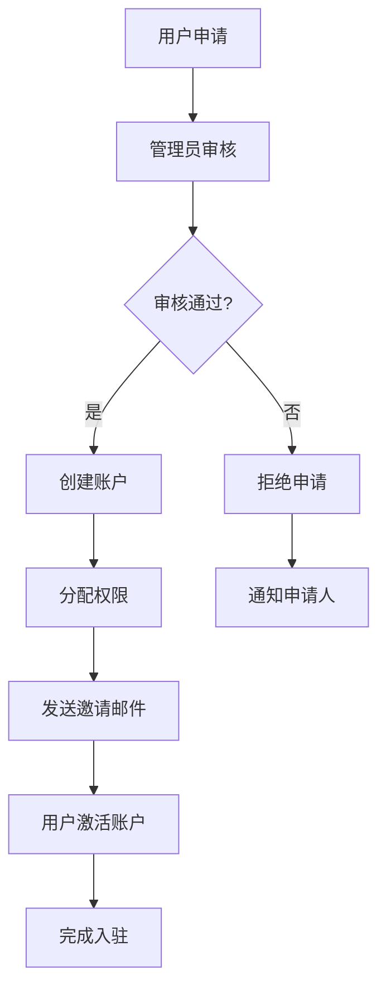
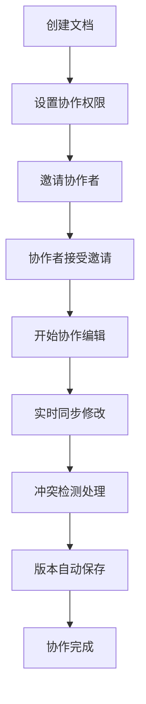
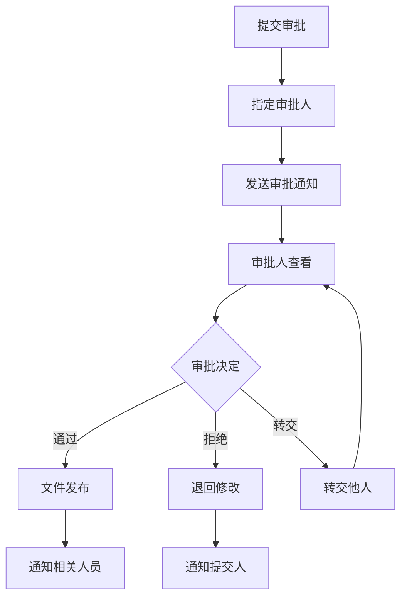

# Nextcloud 业务架构设计与功能清单

## 1. 业务架构概览

### 1.1 业务定位
Nextcloud是一个企业级私有云协作平台，为组织提供安全、可控的数据存储、同步、共享和协作解决方案。

### 1.2 核心价值主张
- **数据主权**: 完全控制数据存储位置和访问权限
- **安全合规**: 满足企业级安全和合规要求
- **开放生态**: 支持丰富的第三方应用和集成
- **成本效益**: 降低云服务成本，避免厂商锁定

### 1.3 业务架构图
```
┌─────────────────────────────────────────────────────────────┐
│                    用户接入层                                │
├─────────────────────────────────────────────────────────────┤
│  Web界面  │  移动应用  │  桌面客户端  │  第三方集成  │
└─────────────────────────────────────────────────────────────┘
                              │
┌─────────────────────────────────────────────────────────────┐
│                    业务服务层                                │
├─────────────────────────────────────────────────────────────┤
│  文件管理  │  协作办公  │  通讯沟通  │  项目管理  │
│  用户管理  │  权限控制  │  审计监控  │  系统管理  │
└─────────────────────────────────────────────────────────────┘
                              │
┌─────────────────────────────────────────────────────────────┐
│                    平台支撑层                                │
├─────────────────────────────────────────────────────────────┤
│  应用商店  │  插件引擎  │  API网关  │  事件总线  │
│  工作流引擎│  通知中心  │  搜索引擎  │  缓存系统  │
└─────────────────────────────────────────────────────────────┘
                              │
┌─────────────────────────────────────────────────────────────┐
│                    基础设施层                                │
├─────────────────────────────────────────────────────────────┤
│  存储系统  │  数据库    │  认证系统  │  监控系统  │
│  备份系统  │  负载均衡  │  安全防护  │  日志系统  │
└─────────────────────────────────────────────────────────────┘
```

## 2. 核心业务模块

### 2.1 文件管理服务

#### 2.1.1 文件存储管理
**业务价值**: 提供安全可靠的文件存储服务
**核心功能**:
- 文件上传下载
- 文件夹组织管理
- 文件版本控制
- 文件预览和编辑
- 文件搜索和标签
- 存储配额管理

**业务流程**:
```
用户上传文件 → 病毒扫描 → 存储分配 → 索引建立 → 权限设置 → 完成存储
```

#### 2.1.2 文件同步服务
**业务价值**: 确保多设备间文件一致性
**核心功能**:
- 实时同步
- 增量同步
- 冲突解决
- 离线访问
- 选择性同步

**业务场景**:
- 移动办公文件同步
- 团队文件协作
- 多设备文件访问
- 离线工作支持

#### 2.1.3 文件共享服务
**业务价值**: 促进内外部协作和信息共享
**核心功能**:
- 内部用户共享
- 外部链接共享
- 密码保护共享
- 时效性控制
- 下载统计

**权限模型**:
- 只读权限
- 编辑权限
- 评论权限
- 重新共享权限
- 删除权限

### 2.2 协作办公服务

#### 2.2.1 在线文档协作
**业务价值**: 提升团队协作效率，减少版本冲突
**核心功能**:
- 多人实时编辑
- 文档评论批注
- 版本历史追踪
- 变更通知
- 格式兼容性

**支持格式**:
- Office文档 (Word, Excel, PowerPoint)
- PDF文档
- 文本文件
- 图片文件
- 代码文件

#### 2.2.2 项目协作管理
**业务价值**: 提供项目管理和团队协作工具
**核心功能**:
- 项目空间管理
- 任务分配跟踪
- 里程碑管理
- 团队讨论
- 进度报告

#### 2.2.3 日历和联系人
**业务价值**: 统一的时间和联系人管理
**核心功能**:
- 个人和共享日历
- 会议安排
- 提醒通知
- 联系人管理
- 地址簿同步

### 2.3 通讯沟通服务

#### 2.3.1 即时通讯
**业务价值**: 提供企业内部安全通讯渠道
**核心功能**:
- 一对一聊天
- 群组讨论
- 文件传输
- 语音通话
- 视频会议

#### 2.3.2 邮件集成
**业务价值**: 统一邮件和文件管理
**核心功能**:
- 邮件收发
- 附件管理
- 邮件搜索
- 邮件归档
- 邮件模板

### 2.4 用户和权限管理

#### 2.4.1 用户生命周期管理
**业务价值**: 规范化用户管理流程
**核心功能**:
- 用户注册审批
- 账户激活
- 权限分配
- 账户停用
- 数据迁移

#### 2.4.2 组织架构管理
**业务价值**: 反映企业组织结构
**核心功能**:
- 部门层级管理
- 用户组管理
- 角色权限管理
- 委派授权
- 权限继承

#### 2.4.3 身份认证服务
**业务价值**: 确保系统安全访问
**核心功能**:
- 多因素认证
- 单点登录(SSO)
- LDAP/AD集成
- OAuth集成
- 会话管理

## 3. 业务支撑平台

### 3.1 应用生态平台

#### 3.1.1 应用商店
**业务价值**: 扩展平台功能，满足个性化需求
**核心功能**:
- 应用浏览发现
- 应用安装管理
- 应用评价反馈
- 应用更新升级
- 应用权限管理

**应用分类**:
- 办公协作类
- 项目管理类
- 通讯社交类
- 开发工具类
- 行业专用类

#### 3.1.2 插件开发平台
**业务价值**: 支持定制化开发，满足特殊业务需求
**核心功能**:
- 开发框架
- API接口
- 开发工具
- 测试环境
- 发布管理

### 3.2 工作流引擎

#### 3.2.1 业务流程自动化
**业务价值**: 提高业务处理效率，减少人工干预
**核心功能**:
- 流程设计器
- 条件判断
- 自动执行
- 人工审批
- 流程监控

**典型场景**:
- 文档审批流程
- 项目申请流程
- 权限申请流程
- 数据备份流程

#### 3.2.2 事件驱动自动化
**业务价值**: 基于事件触发的智能化处理
**核心功能**:
- 事件监听
- 规则引擎
- 动作执行
- 通知推送
- 日志记录

### 3.3 数据分析平台

#### 3.3.1 使用情况分析
**业务价值**: 了解系统使用情况，优化资源配置
**核心功能**:
- 用户活跃度分析
- 文件访问统计
- 存储使用分析
- 功能使用统计
- 性能指标监控

#### 3.3.2 安全审计分析
**业务价值**: 确保系统安全合规
**核心功能**:
- 登录行为分析
- 文件操作审计
- 权限变更记录
- 异常行为检测
- 合规报告生成

## 4. 核心业务功能清单

### 4.1 文件管理功能

| 功能模块 | 核心功能 | 业务价值 | 优先级 |
|---------|---------|---------|--------|
| 文件上传 | 拖拽上传、批量上传、断点续传 | 提升用户体验 | 高 |
| 文件预览 | 图片、文档、视频预览 | 快速查看内容 | 高 |
| 文件编辑 | 在线编辑、协同编辑 | 提升协作效率 | 高 |
| 版本控制 | 版本历史、版本对比、版本恢复 | 防止数据丢失 | 中 |
| 文件搜索 | 全文搜索、标签搜索、高级搜索 | 快速定位文件 | 中 |
| 文件标签 | 自定义标签、标签分类 | 文件组织管理 | 低 |

### 4.2 协作功能

| 功能模块 | 核心功能 | 业务价值 | 优先级 |
|---------|---------|---------|--------|
| 文件共享 | 内部共享、外部共享、权限控制 | 促进协作 | 高 |
| 实时协作 | 多人编辑、实时同步、冲突解决 | 提升效率 | 高 |
| 评论批注 | 文件评论、行内批注、@提醒 | 沟通反馈 | 中 |
| 活动流 | 操作记录、变更通知 | 信息透明 | 中 |
| 项目空间 | 项目文件夹、成员管理 | 项目协作 | 中 |

### 4.3 通讯功能

| 功能模块 | 核心功能 | 业务价值 | 优先级 |
|---------|---------|---------|--------|
| 即时消息 | 文字聊天、表情符号、文件传输 | 即时沟通 | 高 |
| 语音通话 | 一对一通话、群组通话 | 语音沟通 | 中 |
| 视频会议 | 视频通话、屏幕共享、会议录制 | 远程协作 | 中 |
| 邮件集成 | 邮件收发、附件管理 | 统一通讯 | 低 |

### 4.4 管理功能

| 功能模块 | 核心功能 | 业务价值 | 优先级 |
|---------|---------|---------|--------|
| 用户管理 | 用户增删改查、批量导入 | 用户管理 | 高 |
| 权限管理 | 角色权限、资源权限、继承权限 | 安全控制 | 高 |
| 组织管理 | 部门管理、用户组管理 | 组织架构 | 中 |
| 系统配置 | 参数配置、功能开关 | 系统管理 | 中 |
| 监控告警 | 性能监控、异常告警 | 运维管理 | 中 |

### 4.5 安全功能

| 功能模块 | 核心功能 | 业务价值 | 优先级 |
|---------|---------|---------|--------|
| 身份认证 | 多因素认证、SSO集成 | 身份安全 | 高 |
| 访问控制 | IP白名单、时间限制 | 访问安全 | 高 |
| 数据加密 | 传输加密、存储加密 | 数据安全 | 高 |
| 审计日志 | 操作日志、登录日志 | 安全审计 | 中 |
| 病毒扫描 | 文件扫描、实时防护 | 内容安全 | 中 |

## 5. 业务场景和用例

### 5.1 企业文档管理场景

**业务背景**: 企业需要统一管理各类文档，确保文档安全和版本控制

**主要用例**:
1. **文档集中存储**: 将分散的文档统一存储到私有云
2. **权限分级管理**: 根据部门和职级设置文档访问权限
3. **版本控制**: 重要文档的版本管理和历史追踪
4. **审批流程**: 文档发布前的审批和签署流程
5. **合规归档**: 按照合规要求进行文档归档和保留

**业务价值**:
- 提高文档管理效率
- 确保文档安全合规
- 减少版本混乱问题
- 支持远程办公需求

### 5.2 团队协作办公场景

**业务背景**: 团队需要高效协作，特别是远程和混合办公模式

**主要用例**:
1. **项目协作空间**: 为每个项目创建独立的协作空间
2. **实时文档协作**: 多人同时编辑文档，实时同步修改
3. **任务分配跟踪**: 分配任务并跟踪完成进度
4. **会议和沟通**: 集成视频会议和即时通讯
5. **知识分享**: 建立团队知识库和最佳实践分享

**业务价值**:
- 提升团队协作效率
- 减少沟通成本
- 提高项目交付质量
- 促进知识传承

### 5.3 客户协作场景

**业务背景**: 需要与外部客户、合作伙伴进行安全的文件共享和协作

**主要用例**:
1. **客户文件共享**: 安全地与客户共享项目文件
2. **外部协作**: 邀请外部用户参与特定项目协作
3. **文件收集**: 从客户处收集所需文件和资料
4. **进度透明**: 让客户实时了解项目进展
5. **合同管理**: 合同文档的协作编辑和电子签署

**业务价值**:
- 提升客户满意度
- 加强合作伙伴关系
- 提高项目透明度
- 简化协作流程

### 5.4 移动办公场景

**业务背景**: 支持员工随时随地访问和处理工作文件

**主要用例**:
1. **移动文件访问**: 通过手机和平板访问工作文件
2. **离线工作**: 离线下载文件，在线同步修改
3. **移动审批**: 通过移动设备进行文档审批
4. **现场协作**: 在客户现场实时协作和文件共享
5. **安全访问**: 确保移动设备访问的安全性

**业务价值**:
- 提高工作灵活性
- 支持远程办公
- 提升响应速度
- 增强竞争优势

## 6. 技术架构支撑

### 6.1 微服务架构设计

**核心服务模块**:
- 用户服务 (User Service)
- 文件服务 (File Service)
- 协作服务 (Collaboration Service)
- 通知服务 (Notification Service)
- 搜索服务 (Search Service)
- 工作流服务 (Workflow Service)

**服务间通信**:
- RESTful API
- 事件总线
- 消息队列
- 服务发现

### 6.2 数据架构设计

**数据分层**:
- 业务数据层: 用户、文件、权限等业务数据
- 元数据层: 文件索引、标签、关系等元数据
- 日志数据层: 操作日志、审计日志、性能日志
- 缓存数据层: 热点数据、会话数据、临时数据

**数据存储**:
- 关系型数据库: 业务数据和元数据
- 对象存储: 文件内容存储
- 搜索引擎: 全文搜索索引
- 缓存系统: 高频访问数据

### 6.3 安全架构设计

**安全层次**:
- 网络安全: 防火墙、DDoS防护、VPN接入
- 应用安全: 身份认证、权限控制、数据验证
- 数据安全: 加密存储、传输加密、密钥管理
- 运维安全: 访问审计、操作监控、安全扫描

**合规支持**:
- GDPR合规
- SOX合规
- ISO27001标准
- 等保要求

## 7. 业务流程设计

### 7.1 用户入驻流程



**业务规则**:
- 新用户必须通过管理员审核
- 用户信息必须完整准确
- 默认分配基础权限
- 激活链接24小时内有效

### 7.2 文件协作流程



**业务规则**:
- 文档创建者拥有完全控制权
- 协作者权限可分级设置
- 自动检测和解决编辑冲突
- 每次修改自动创建版本快照

### 7.3 文件审批流程



**业务规则**:
- 支持多级审批流程
- 审批人可添加审批意见
- 支持审批权限委派
- 审批超时自动提醒

## 8. 数据模型设计

### 8.1 用户数据模型

```
用户实体 (User)
├── 基本信息
│   ├── 用户ID (user_id)
│   ├── 用户名 (username)
│   ├── 邮箱 (email)
│   ├── 显示名称 (display_name)
│   └── 头像 (avatar)
├── 认证信息
│   ├── 密码哈希 (password_hash)
│   ├── 双因素认证 (two_factor_auth)
│   └── 最后登录时间 (last_login)
├── 组织信息
│   ├── 部门ID (department_id)
│   ├── 职位 (position)
│   └── 上级主管 (manager_id)
└── 系统信息
    ├── 创建时间 (created_at)
    ├── 更新时间 (updated_at)
    ├── 状态 (status)
    └── 配额 (quota)
```

### 8.2 文件数据模型

```
文件实体 (File)
├── 基本信息
│   ├── 文件ID (file_id)
│   ├── 文件名 (filename)
│   ├── 文件路径 (file_path)
│   ├── 文件大小 (file_size)
│   └── 文件类型 (mime_type)
├── 元数据
│   ├── 创建者 (creator_id)
│   ├── 创建时间 (created_at)
│   ├── 修改时间 (modified_at)
│   ├── 访问时间 (accessed_at)
│   └── 文件哈希 (file_hash)
├── 版本信息
│   ├── 版本号 (version)
│   ├── 版本历史 (version_history)
│   └── 是否最新版本 (is_latest)
└── 扩展信息
    ├── 标签 (tags)
    ├── 描述 (description)
    ├── 自定义属性 (custom_properties)
    └── 索引状态 (index_status)
```

### 8.3 权限数据模型

```
权限实体 (Permission)
├── 主体信息
│   ├── 主体类型 (subject_type) [用户/组/角色]
│   └── 主体ID (subject_id)
├── 客体信息
│   ├── 资源类型 (resource_type) [文件/文件夹/应用]
│   └── 资源ID (resource_id)
├── 权限信息
│   ├── 权限类型 (permission_type)
│   ├── 权限级别 (permission_level)
│   └── 权限范围 (permission_scope)
└── 时效信息
    ├── 生效时间 (effective_from)
    ├── 失效时间 (expires_at)
    └── 创建时间 (created_at)
```

## 9. 接口设计规范

### 9.1 RESTful API设计

#### 9.1.1 用户管理API
```
GET    /api/v1/users              # 获取用户列表
POST   /api/v1/users              # 创建新用户
GET    /api/v1/users/{id}         # 获取用户详情
PUT    /api/v1/users/{id}         # 更新用户信息
DELETE /api/v1/users/{id}         # 删除用户
GET    /api/v1/users/{id}/groups  # 获取用户所属组
POST   /api/v1/users/{id}/groups  # 添加用户到组
```

#### 9.1.2 文件管理API
```
GET    /api/v1/files              # 获取文件列表
POST   /api/v1/files              # 上传文件
GET    /api/v1/files/{id}         # 获取文件信息
PUT    /api/v1/files/{id}         # 更新文件
DELETE /api/v1/files/{id}         # 删除文件
GET    /api/v1/files/{id}/content # 下载文件内容
GET    /api/v1/files/{id}/preview # 获取文件预览
POST   /api/v1/files/{id}/share   # 分享文件
```

#### 9.1.3 协作管理API
```
GET    /api/v1/collaborations           # 获取协作列表
POST   /api/v1/collaborations           # 创建协作
GET    /api/v1/collaborations/{id}      # 获取协作详情
PUT    /api/v1/collaborations/{id}      # 更新协作
DELETE /api/v1/collaborations/{id}      # 删除协作
POST   /api/v1/collaborations/{id}/join # 加入协作
```

### 9.2 WebDAV接口设计

#### 9.2.1 文件操作
```
PROPFIND /remote.php/dav/files/{user}/  # 获取文件属性
GET      /remote.php/dav/files/{user}/  # 下载文件
PUT      /remote.php/dav/files/{user}/  # 上传文件
MOVE     /remote.php/dav/files/{user}/  # 移动文件
COPY     /remote.php/dav/files/{user}/  # 复制文件
DELETE   /remote.php/dav/files/{user}/  # 删除文件
MKCOL    /remote.php/dav/files/{user}/  # 创建文件夹
```

#### 9.2.2 日历操作
```
PROPFIND /remote.php/dav/calendars/{user}/  # 获取日历列表
GET      /remote.php/dav/calendars/{user}/  # 获取日历事件
PUT      /remote.php/dav/calendars/{user}/  # 创建/更新事件
DELETE   /remote.php/dav/calendars/{user}/  # 删除事件
REPORT   /remote.php/dav/calendars/{user}/  # 查询事件
```

## 10. 部署实施指南

### 10.1 环境规划

#### 10.1.1 硬件资源规划
```
小型部署 (100用户以内):
- CPU: 4核心
- 内存: 8GB
- 存储: 500GB SSD
- 网络: 100Mbps

中型部署 (1000用户以内):
- CPU: 8核心
- 内存: 16GB
- 存储: 2TB SSD + 10TB HDD
- 网络: 1Gbps

大型部署 (10000用户以内):
- CPU: 16核心
- 内存: 32GB
- 存储: 5TB SSD + 50TB HDD
- 网络: 10Gbps
```

#### 10.1.2 软件环境要求
```
操作系统:
- Ubuntu 20.04 LTS (推荐)
- CentOS 8
- RHEL 8
- Debian 11

Web服务器:
- Nginx 1.18+ (推荐)
- Apache 2.4+

数据库:
- MySQL 8.0+ (推荐)
- MariaDB 10.6+
- PostgreSQL 13+

PHP环境:
- PHP 8.1+ (推荐)
- PHP-FPM
- 必需扩展: gd, zip, curl, xml, mbstring, intl
```

### 10.2 安装部署流程

#### 10.2.1 基础环境准备
```bash
# 1. 更新系统
sudo apt update && sudo apt upgrade -y

# 2. 安装基础软件
sudo apt install -y nginx mysql-server php8.1-fpm php8.1-mysql \
    php8.1-gd php8.1-zip php8.1-curl php8.1-xml php8.1-mbstring \
    php8.1-intl php8.1-bcmath php8.1-imagick

# 3. 配置数据库
sudo mysql_secure_installation

# 4. 创建数据库和用户
mysql -u root -p
CREATE DATABASE nextcloud;
CREATE USER 'nextcloud'@'localhost' IDENTIFIED BY 'password';
GRANT ALL PRIVILEGES ON nextcloud.* TO 'nextcloud'@'localhost';
FLUSH PRIVILEGES;
```

#### 10.2.2 Nextcloud安装
```bash
# 1. 下载Nextcloud
cd /var/www
sudo wget https://download.nextcloud.com/server/releases/latest.tar.bz2
sudo tar -xjf latest.tar.bz2
sudo chown -R www-data:www-data nextcloud

# 2. 配置Nginx
sudo nano /etc/nginx/sites-available/nextcloud

# 3. 启用站点
sudo ln -s /etc/nginx/sites-available/nextcloud /etc/nginx/sites-enabled/
sudo nginx -t && sudo systemctl reload nginx

# 4. 运行安装向导
# 访问 https://your-domain.com 完成安装
```

### 10.3 配置优化

#### 10.3.1 性能优化配置
```php
// config/config.php
'memcache.local' => '\OC\Memcache\APCu',
'memcache.distributed' => '\OC\Memcache\Redis',
'memcache.locking' => '\OC\Memcache\Redis',
'redis' => [
    'host' => 'localhost',
    'port' => 6379,
],
'default_phone_region' => 'CN',
'maintenance_window_start' => 1,
```

#### 10.3.2 安全配置
```php
// config/config.php
'trusted_domains' => [
    'your-domain.com',
    'www.your-domain.com',
],
'overwrite.cli.url' => 'https://your-domain.com',
'htaccess.RewriteBase' => '/',
'auth.bruteforce.protection.enabled' => true,
'auth.webauthn.enabled' => true,
'two_factor_auth.enabled' => true,
```

## 11. 运维监控方案

### 11.1 监控指标体系

#### 11.1.1 系统性能指标
- CPU使用率
- 内存使用率
- 磁盘使用率
- 网络带宽使用
- 磁盘I/O性能

#### 11.1.2 应用性能指标
- 响应时间
- 吞吐量
- 错误率
- 并发用户数
- 数据库连接数

#### 11.1.3 业务指标
- 用户活跃度
- 文件上传下载量
- 存储空间使用
- 协作会话数
- 功能使用统计

### 11.2 告警机制

#### 11.2.1 告警级别
- **紧急**: 系统不可用，需要立即处理
- **重要**: 功能异常，影响用户使用
- **警告**: 性能下降，需要关注
- **信息**: 状态变化，仅作记录

#### 11.2.2 告警规则
```yaml
# 系统告警规则
alerts:
  - name: high_cpu_usage
    condition: cpu_usage > 80%
    duration: 5m
    level: warning

  - name: disk_space_low
    condition: disk_usage > 90%
    duration: 1m
    level: important

  - name: service_down
    condition: service_status == down
    duration: 30s
    level: critical
```

### 11.3 备份恢复策略

#### 11.3.1 备份策略
- **全量备份**: 每周一次，保留4周
- **增量备份**: 每天一次，保留7天
- **实时备份**: 重要数据实时同步
- **异地备份**: 关键数据异地存储

#### 11.3.2 恢复测试
- 定期进行恢复演练
- 验证备份数据完整性
- 测试恢复时间目标(RTO)
- 验证恢复点目标(RPO)

---

*本文档从业务视角全面梳理了Nextcloud的架构设计和功能清单，包含详细的业务流程、数据模型、接口设计和部署实施指南，为产品规划和开发提供完整的指导框架。*
