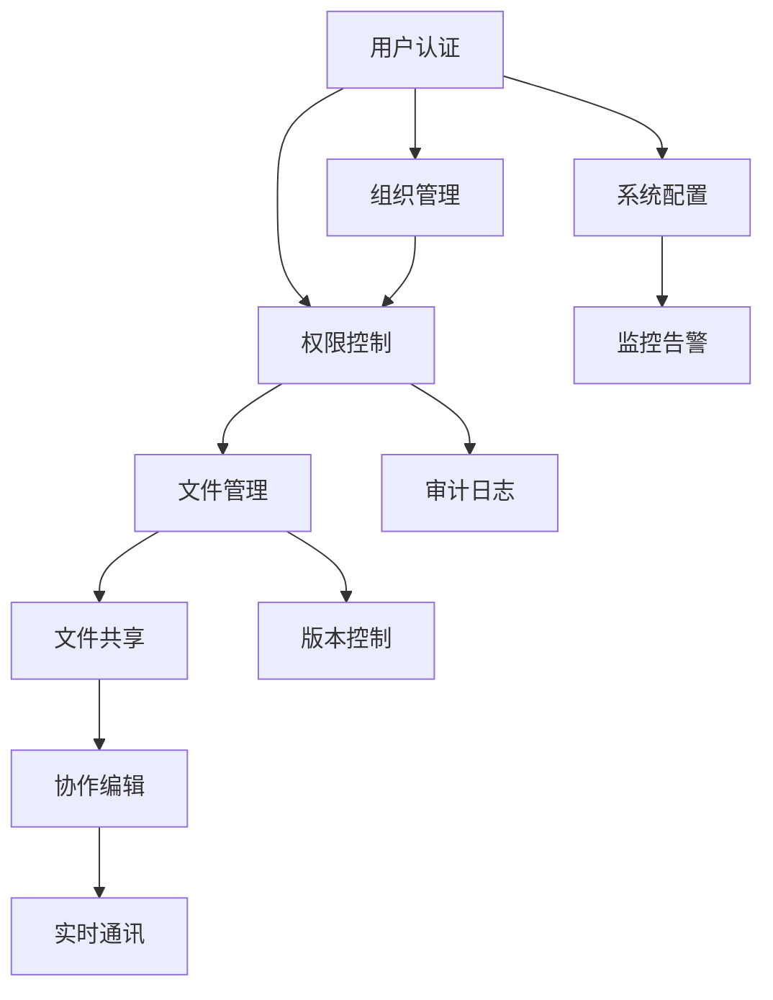

# Nextcloud 业务需求与开发指南

## 📋 文档概述

本文档基于业务视角，整理了Nextcloud云存储平台的完整业务架构设计和功能需求清单，为产品规划、开发实施和项目管理提供全面的指导框架。

## 🎯 业务目标与价值定位

### 核心业务目标
1. **数据主权保护**: 为企业提供完全自主可控的数据存储解决方案
2. **协作效率提升**: 通过统一平台提升团队协作和工作效率
3. **安全合规保障**: 满足企业级安全要求和行业合规标准
4. **成本效益优化**: 降低云服务成本，避免厂商锁定风险

### 目标用户群体
- **中小企业**: 需要专业云协作平台的成长型企业
- **大型企业**: 需要私有云解决方案的大型组织
- **政府机构**: 对数据安全有严格要求的政府部门
- **教育机构**: 需要教学协作平台的学校和培训机构
- **医疗机构**: 需要合规数据管理的医疗健康机构

## 🏗️ 业务架构设计

### 业务能力地图
```
┌─────────────────────────────────────────────────────────────┐
│                    核心业务能力                              │
├─────────────────────────────────────────────────────────────┤
│  文件管理  │  协作办公  │  通讯沟通  │  项目管理  │
│  • 存储    │  • 共享    │  • 聊天    │  • 任务    │
│  • 同步    │  • 编辑    │  • 会议    │  • 计划    │
│  • 版本    │  • 评论    │  • 邮件    │  • 跟踪    │
└─────────────────────────────────────────────────────────────┘
┌─────────────────────────────────────────────────────────────┐
│                    支撑业务能力                              │
├─────────────────────────────────────────────────────────────┤
│  用户管理  │  权限控制  │  安全审计  │  系统管理  │
│  • 认证    │  • 授权    │  • 日志    │  • 配置    │
│  • 组织    │  • 角色    │  • 监控    │  • 监控    │
│  • 生命周期│  • 委派    │  • 合规    │  • 运维    │
└─────────────────────────────────────────────────────────────┘
┌─────────────────────────────────────────────────────────────┐
│                    扩展业务能力                              │
├─────────────────────────────────────────────────────────────┤
│  应用生态  │  工作流    │  数据分析  │  集成对接  │
│  • 应用商店│  • 流程    │  • 报表    │  • API     │
│  • 插件    │  • 自动化  │  • 统计    │  • 第三方  │
│  • 定制    │  • 规则    │  • 洞察    │  • 同步    │
└─────────────────────────────────────────────────────────────┘
```

### 业务流程架构

#### 核心业务流程
1. **用户入驻流程**: 注册 → 审核 → 激活 → 权限分配 → 培训引导
2. **文件协作流程**: 上传 → 共享 → 协作编辑 → 版本管理 → 归档
3. **项目管理流程**: 创建 → 规划 → 执行 → 监控 → 交付
4. **审批流程**: 发起 → 审批 → 决策 → 执行 → 归档

#### 支撑业务流程
1. **权限管理流程**: 申请 → 审批 → 授权 → 监控 → 回收
2. **安全审计流程**: 监控 → 检测 → 分析 → 报告 → 改进
3. **系统运维流程**: 监控 → 告警 → 处理 → 恢复 → 总结

## 📊 功能需求矩阵

### 核心功能优先级矩阵

| 功能模块 | 核心功能 | 业务价值 | 技术复杂度 | 开发优先级 |
|---------|---------|---------|-----------|-----------|
| **文件管理** | 文件上传下载 | 极高 | 中 | P0 |
| | 文件预览编辑 | 高 | 高 | P1 |
| | 版本控制 | 中 | 中 | P2 |
| **协作共享** | 文件共享 | 极高 | 中 | P0 |
| | 实时协作 | 高 | 高 | P1 |
| | 评论批注 | 中 | 低 | P2 |
| **用户管理** | 身份认证 | 极高 | 中 | P0 |
| | 权限控制 | 极高 | 高 | P0 |
| | 组织管理 | 高 | 中 | P1 |
| **通讯功能** | 即时消息 | 中 | 中 | P2 |
| | 视频会议 | 中 | 高 | P3 |
| | 邮件集成 | 低 | 中 | P3 |
| **系统管理** | 系统配置 | 高 | 低 | P1 |
| | 监控日志 | 高 | 中 | P1 |
| | 备份恢复 | 高 | 中 | P1 |

### 功能依赖关系图



## 🚀 开发实施路线图

### 第一阶段：核心基础功能 (3个月)
**目标**: 建立基础平台，支持基本文件管理和用户管理

**核心交付物**:
- 用户认证和权限系统
- 基础文件上传下载功能
- 简单文件共享功能
- 基础系统管理功能

**验收标准**:
- 支持100并发用户
- 文件上传下载成功率>99%
- 用户认证响应时间<2秒
- 基础功能可用性>99%

### 第二阶段：协作功能增强 (2个月)
**目标**: 增强协作能力，支持团队协作场景

**核心交付物**:
- 文件预览和在线编辑
- 实时协作编辑功能
- 评论和反馈系统
- 版本控制功能

**验收标准**:
- 支持主流文档格式预览
- 实时协作延迟<500ms
- 版本控制准确率100%
- 协作功能稳定性>98%

### 第三阶段：高级功能完善 (2个月)
**目标**: 完善高级功能，提升用户体验

**核心交付物**:
- 全文搜索功能
- 工作流引擎
- 移动端支持
- 第三方集成

**验收标准**:
- 搜索响应时间<1秒
- 工作流执行成功率>95%
- 移动端功能完整性>90%
- API接口稳定性>99%

### 第四阶段：企业级增强 (3个月)
**目标**: 增强企业级特性，满足大规模部署需求

**核心交付物**:
- 高可用部署方案
- 安全审计功能
- 性能优化
- 运维管理工具

**验收标准**:
- 系统可用性>99.9%
- 支持1000+并发用户
- 安全审计覆盖率100%
- 运维自动化程度>80%

## 💼 商业模式设计

### 产品定位策略
1. **开源基础版**: 免费提供核心功能，建立用户基础
2. **企业增强版**: 付费提供企业级功能和技术支持
3. **云服务版**: 提供托管云服务，降低部署门槛
4. **定制开发**: 为大客户提供定制化开发服务

### 盈利模式
1. **技术支持服务**: 提供专业技术支持和咨询服务
2. **企业功能授权**: 企业级功能模块授权费用
3. **云服务订阅**: 按用户数和存储量收费的云服务
4. **培训认证**: 提供产品培训和技术认证服务

### 市场推广策略
1. **开源社区建设**: 建立活跃的开源社区，扩大影响力
2. **合作伙伴生态**: 发展系统集成商和解决方案提供商
3. **行业解决方案**: 针对特定行业提供专业解决方案
4. **技术营销**: 通过技术分享和案例展示建立品牌

## 🔧 技术实施指南

### 技术架构选型

#### 后端技术栈
- **编程语言**: PHP 8.1+ (主要), Node.js (辅助)
- **Web框架**: Symfony组件, 自研应用框架
- **数据库**: MySQL/MariaDB (主), PostgreSQL (可选)
- **缓存**: Redis (分布式缓存), APCu (本地缓存)
- **搜索**: Elasticsearch (全文搜索)
- **消息队列**: Redis/RabbitMQ

#### 前端技术栈
- **框架**: Vue.js 3.x
- **构建工具**: Webpack 5.x
- **UI组件**: 自研组件库
- **状态管理**: Vuex/Pinia
- **CSS预处理**: SCSS
- **测试框架**: Jest, Cypress

#### 基础设施
- **容器化**: Docker + Kubernetes
- **负载均衡**: Nginx/HAProxy
- **监控**: Prometheus + Grafana
- **日志**: ELK Stack
- **CI/CD**: GitLab CI/GitHub Actions

### 开发规范标准

#### 代码规范
- **PHP**: PSR-1, PSR-2, PSR-4标准
- **JavaScript**: ESLint + Prettier
- **CSS**: BEM命名规范
- **Git**: Conventional Commits规范

#### 质量保证
- **代码覆盖率**: >80%
- **代码审查**: 强制PR审查
- **自动化测试**: 单元测试 + 集成测试
- **性能测试**: 定期性能基准测试

#### 安全规范
- **输入验证**: 所有用户输入必须验证
- **输出编码**: 防止XSS攻击
- **SQL注入防护**: 使用参数化查询
- **权限检查**: 每个操作都要权限验证

## 📈 项目管理框架

### 开发方法论
采用**敏捷开发**方法，结合**DevOps**实践：

1. **迭代周期**: 2周一个迭代
2. **团队组织**: 跨功能团队，包含前端、后端、测试、运维
3. **沟通机制**: 每日站会、迭代回顾、计划会议
4. **交付标准**: 每个迭代都要有可演示的功能

### 质量管理
1. **需求管理**: 用户故事 + 验收标准
2. **缺陷管理**: 缺陷分级处理，零缺陷发布
3. **风险管理**: 风险识别、评估、应对
4. **变更管理**: 变更影响分析、审批流程

### 团队协作
1. **角色定义**: 产品经理、架构师、开发工程师、测试工程师、运维工程师
2. **沟通工具**: Slack/钉钉 + Jira + Confluence
3. **知识管理**: 技术文档、最佳实践、经验分享
4. **技能发展**: 技术培训、代码审查、技术分享

## 🎯 成功指标与KPI

### 技术指标
- **系统可用性**: >99.9%
- **响应时间**: 页面加载<3秒，API响应<200ms
- **并发能力**: 支持1000+并发用户
- **数据安全**: 零数据丢失事故

### 业务指标
- **用户增长**: 月活跃用户增长率>20%
- **用户满意度**: NPS评分>50
- **功能使用率**: 核心功能使用率>80%
- **客户留存**: 年客户留存率>90%

### 运营指标
- **部署成功率**: >95%
- **问题解决时间**: 平均<4小时
- **文档完整性**: 100%
- **培训覆盖率**: >90%

---

**本指南为Nextcloud项目的业务需求分析和开发实施提供了完整的框架，涵盖了从业务目标到技术实现的全过程，为项目成功交付提供有力保障。**
