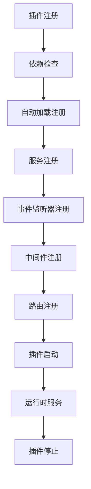

# Nextcloud 插件开发指南

## 1. 插件开发概述

### 1.1 插件架构原理
Nextcloud采用模块化架构，每个插件(App)都是一个独立的功能模块，通过标准化的接口与核心系统交互。插件系统基于以下核心概念：

- **依赖注入容器**: 管理服务实例和依赖关系
- **事件驱动架构**: 通过事件系统实现松耦合
- **中间件机制**: 提供请求处理的拦截和增强
- **路由系统**: 处理HTTP请求到控制器的映射
- **数据抽象层**: 提供数据库操作的统一接口

### 1.2 插件生命周期


### 1.3 开发环境要求
```bash
# 基础环境
PHP >= 8.1
Node.js >= 18.0
Composer >= 2.0
npm/yarn

# 开发工具
PHPStorm/VSCode
Xdebug (调试)
PHPUnit (测试)
Webpack (前端构建)
Git (版本控制)

# 可选工具
Docker (容器化)
Redis (缓存)
Elasticsearch (搜索)
```

## 2. 插件项目结构

### 2.1 标准目录结构
```
apps/my_plugin/
├── appinfo/                 # 应用元数据
│   ├── info.xml            # 应用信息配置
│   ├── routes.php          # 路由定义
│   └── Application.php     # 应用启动类
├── lib/                    # PHP后端代码
│   ├── AppInfo/           # 应用信息类
│   ├── Controller/        # 控制器层
│   ├── Service/          # 业务逻辑层
│   ├── Db/               # 数据访问层
│   ├── Migration/        # 数据库迁移
│   ├── Command/          # 命令行工具
│   ├── BackgroundJob/    # 后台任务
│   ├── Listener/         # 事件监听器
│   └── Middleware/       # 中间件
├── src/                   # 前端源码
│   ├── components/       # Vue组件
│   ├── views/           # 页面视图
│   ├── store/           # 状态管理
│   ├── router/          # 路由配置
│   └── main.js          # 入口文件
├── templates/            # 服务端模板
├── css/                 # 样式文件
├── img/                 # 图片资源
├── l10n/                # 国际化文件
├── tests/               # 测试文件
│   ├── Unit/           # 单元测试
│   ├── Integration/    # 集成测试
│   └── fixtures/       # 测试数据
├── composer.json        # PHP依赖管理
├── package.json         # Node.js依赖管理
├── webpack.config.js    # 前端构建配置
├── Makefile            # 构建脚本
└── README.md           # 项目说明
```

### 2.2 核心配置文件

#### 2.2.1 应用信息配置 (appinfo/info.xml)
```xml
<?xml version="1.0"?>
<info xmlns:xsi="http://www.w3.org/2001/XMLSchema-instance"
      xsi:noNamespaceSchemaLocation="https://apps.nextcloud.com/schema/apps/info.xsd">
    <!-- 基本信息 -->
    <id>my_plugin</id>
    <name>My Plugin</name>
    <summary>A comprehensive plugin example</summary>
    <description><![CDATA[
        This plugin demonstrates all the key features of Nextcloud plugin development,
        including file management, user interaction, and third-party integrations.
    ]]></description>
    
    <!-- 版本和许可 -->
    <version>1.0.0</version>
    <licence>agpl</licence>
    <author mail="developer@example.com">Developer Name</author>
    <namespace>MyPlugin</namespace>
    
    <!-- 分类和文档 -->
    <category>tools</category>
    <website>https://github.com/example/my_plugin</website>
    <bugs>https://github.com/example/my_plugin/issues</bugs>
    <repository type="git">https://github.com/example/my_plugin.git</repository>
    
    <!-- 依赖关系 -->
    <dependencies>
        <nextcloud min-version="32" max-version="33"/>
        <php min-version="8.1"/>
        <database min-version="5.7">mysql</database>
        <database min-version="10.3">mariadb</database>
        <database min-version="13">pgsql</database>
    </dependencies>
    
    <!-- 应用类型 -->
    <types>
        <filesystem/>
        <dav/>
    </types>
    
    <!-- 后台任务 -->
    <background-jobs>
        <job>OCA\MyPlugin\BackgroundJob\DataSyncJob</job>
        <job>OCA\MyPlugin\BackgroundJob\CleanupJob</job>
    </background-jobs>
    
    <!-- 命令行工具 -->
    <commands>
        <command>OCA\MyPlugin\Command\ImportCommand</command>
        <command>OCA\MyPlugin\Command\ExportCommand</command>
        <command>OCA\MyPlugin\Command\StatusCommand</command>
    </commands>
    
    <!-- 设置页面 -->
    <settings>
        <admin>OCA\MyPlugin\Settings\AdminSettings</admin>
        <admin-section>OCA\MyPlugin\Settings\AdminSection</admin-section>
        <personal>OCA\MyPlugin\Settings\PersonalSettings</personal>
        <personal-section>OCA\MyPlugin\Settings\PersonalSection</personal-section>
    </settings>
    
    <!-- 导航菜单 -->
    <navigations>
        <navigation>
            <name>My Plugin</name>
            <route>my_plugin.page.index</route>
            <icon>app.svg</icon>
            <order>10</order>
        </navigation>
    </navigations>
</info>
```

#### 2.2.2 路由配置 (appinfo/routes.php)
```php
<?php
return [
    'routes' => [
        // 页面路由
        ['name' => 'page#index', 'url' => '/', 'verb' => 'GET'],
        ['name' => 'page#settings', 'url' => '/settings', 'verb' => 'GET'],
        
        // API路由
        ['name' => 'api#items', 'url' => '/api/v1/items', 'verb' => 'GET'],
        ['name' => 'api#createItem', 'url' => '/api/v1/items', 'verb' => 'POST'],
        ['name' => 'api#updateItem', 'url' => '/api/v1/items/{id}', 'verb' => 'PUT'],
        ['name' => 'api#deleteItem', 'url' => '/api/v1/items/{id}', 'verb' => 'DELETE'],
        
        // 文件操作路由
        ['name' => 'file#upload', 'url' => '/api/v1/files/upload', 'verb' => 'POST'],
        ['name' => 'file#download', 'url' => '/api/v1/files/{fileId}/download', 'verb' => 'GET'],
    ],
    
    'ocs' => [
        // OCS API路由
        ['name' => 'ocs#getInfo', 'url' => '/api/v1/info', 'verb' => 'GET'],
        ['name' => 'ocs#updateConfig', 'url' => '/api/v1/config', 'verb' => 'POST'],
    ]
];
```

## 3. 核心组件开发

### 3.1 应用启动类 (Application.php)
```php
<?php
namespace OCA\MyPlugin\AppInfo;

use OCA\MyPlugin\Listener\FileListener;
use OCA\MyPlugin\Middleware\AuthMiddleware;
use OCA\MyPlugin\Service\ItemService;
use OCP\AppFramework\App;
use OCP\AppFramework\Bootstrap\IBootContext;
use OCP\AppFramework\Bootstrap\IBootstrap;
use OCP\AppFramework\Bootstrap\IRegistrationContext;
use OCP\Files\Events\Node\NodeCreatedEvent;

class Application extends App implements IBootstrap {
    public const APP_ID = 'my_plugin';

    public function __construct(array $urlParams = []) {
        parent::__construct(self::APP_ID, $urlParams);
    }

    public function register(IRegistrationContext $context): void {
        // 注册服务
        $context->registerService(ItemService::class, function($c) {
            return new ItemService(
                $c->get(\OCP\IDBConnection::class),
                $c->get(\Psr\Log\LoggerInterface::class),
                $c->get(\OCP\IUserSession::class)
            );
        });

        // 注册事件监听器
        $context->registerEventListener(NodeCreatedEvent::class, FileListener::class);

        // 注册中间件
        $context->registerMiddleware(AuthMiddleware::class);

        // 注册后台任务
        $context->registerBackgroundJob(\OCA\MyPlugin\BackgroundJob\DataSyncJob::class);

        // 注册能力提供者
        $context->registerCapability(\OCA\MyPlugin\Capabilities::class);

        // 注册搜索提供者
        $context->registerSearchProvider(\OCA\MyPlugin\Search\ItemSearchProvider::class);

        // 注册通知提供者
        $context->registerNotifierService(\OCA\MyPlugin\Notification\Notifier::class);
    }

    public function boot(IBootContext $context): void {
        $container = $context->getAppContainer();
        
        // 注册导航菜单
        $this->registerNavigation($container);
        
        // 注册文件操作菜单
        $this->registerFileActions($container);
        
        // 初始化前端资源
        $this->initializeFrontend($container);
    }

    private function registerNavigation($container): void {
        $navigationManager = $container->get(\OCP\INavigationManager::class);
        $urlGenerator = $container->get(\OCP\IURLGenerator::class);
        
        $navigationManager->add([
            'id' => self::APP_ID,
            'order' => 10,
            'href' => $urlGenerator->linkToRoute('my_plugin.page.index'),
            'icon' => $urlGenerator->imagePath(self::APP_ID, 'app.svg'),
            'name' => 'My Plugin'
        ]);
    }

    private function registerFileActions($container): void {
        // 注册文件右键菜单
        \OCP\Util::addScript(self::APP_ID, 'file-actions');
    }

    private function initializeFrontend($container): void {
        // 加载前端资源
        \OCP\Util::addScript(self::APP_ID, 'main');
        \OCP\Util::addStyle(self::APP_ID, 'main');
    }
}
```

### 3.2 控制器开发

#### 3.2.1 页面控制器
```php
<?php
namespace OCA\MyPlugin\Controller;

use OCP\AppFramework\Controller;
use OCP\AppFramework\Http\TemplateResponse;
use OCP\IRequest;
use OCP\Util;

class PageController extends Controller {
    public function __construct(
        string $appName,
        IRequest $request
    ) {
        parent::__construct($appName, $request);
    }

    /**
     * @NoAdminRequired
     * @NoCSRFRequired
     */
    public function index(): TemplateResponse {
        Util::addScript($this->appName, 'main');
        Util::addStyle($this->appName, 'main');
        
        return new TemplateResponse($this->appName, 'index', [
            'app_name' => $this->appName
        ]);
    }

    /**
     * @NoAdminRequired
     * @NoCSRFRequired
     */
    public function settings(): TemplateResponse {
        return new TemplateResponse($this->appName, 'settings');
    }
}
```

#### 3.2.2 API控制器
```php
<?php
namespace OCA\MyPlugin\Controller;

use OCA\MyPlugin\Service\ItemService;
use OCP\AppFramework\ApiController;
use OCP\AppFramework\Http\DataResponse;
use OCP\IRequest;

class ApiController extends ApiController {
    private ItemService $itemService;

    public function __construct(
        string $appName,
        IRequest $request,
        ItemService $itemService
    ) {
        parent::__construct($appName, $request);
        $this->itemService = $itemService;
    }

    /**
     * @NoAdminRequired
     * @NoCSRFRequired
     */
    public function items(): DataResponse {
        try {
            $items = $this->itemService->findAll();
            return new DataResponse($items);
        } catch (\Exception $e) {
            return new DataResponse(['error' => $e->getMessage()], 500);
        }
    }

    /**
     * @NoAdminRequired
     */
    public function createItem(string $name, string $description = ''): DataResponse {
        try {
            $item = $this->itemService->create($name, $description);
            return new DataResponse($item, 201);
        } catch (\InvalidArgumentException $e) {
            return new DataResponse(['error' => $e->getMessage()], 400);
        } catch (\Exception $e) {
            return new DataResponse(['error' => 'Internal server error'], 500);
        }
    }

    /**
     * @NoAdminRequired
     */
    public function updateItem(int $id, string $name, string $description = ''): DataResponse {
        try {
            $item = $this->itemService->update($id, $name, $description);
            return new DataResponse($item);
        } catch (\InvalidArgumentException $e) {
            return new DataResponse(['error' => $e->getMessage()], 400);
        } catch (\Exception $e) {
            return new DataResponse(['error' => 'Internal server error'], 500);
        }
    }

    /**
     * @NoAdminRequired
     */
    public function deleteItem(int $id): DataResponse {
        try {
            $this->itemService->delete($id);
            return new DataResponse(['success' => true]);
        } catch (\InvalidArgumentException $e) {
            return new DataResponse(['error' => $e->getMessage()], 400);
        } catch (\Exception $e) {
            return new DataResponse(['error' => 'Internal server error'], 500);
        }
    }
}
```

### 3.3 服务层开发
```php
<?php
namespace OCA\MyPlugin\Service;

use OCA\MyPlugin\Db\Item;
use OCA\MyPlugin\Db\ItemMapper;
use OCP\AppFramework\Db\DoesNotExistException;
use OCP\IUserSession;
use Psr\Log\LoggerInterface;

class ItemService {
    private ItemMapper $mapper;
    private LoggerInterface $logger;
    private IUserSession $userSession;

    public function __construct(
        ItemMapper $mapper,
        LoggerInterface $logger,
        IUserSession $userSession
    ) {
        $this->mapper = $mapper;
        $this->logger = $logger;
        $this->userSession = $userSession;
    }

    public function findAll(): array {
        $userId = $this->userSession->getUser()->getUID();
        return $this->mapper->findAllForUser($userId);
    }

    public function find(int $id): Item {
        $userId = $this->userSession->getUser()->getUID();
        
        try {
            $item = $this->mapper->find($id);
            
            // 检查权限
            if ($item->getUserId() !== $userId) {
                throw new \InvalidArgumentException('Access denied');
            }
            
            return $item;
        } catch (DoesNotExistException $e) {
            throw new \InvalidArgumentException('Item not found');
        }
    }

    public function create(string $name, string $description = ''): Item {
        if (empty(trim($name))) {
            throw new \InvalidArgumentException('Name cannot be empty');
        }

        $userId = $this->userSession->getUser()->getUID();
        
        $item = new Item();
        $item->setName($name);
        $item->setDescription($description);
        $item->setUserId($userId);
        $item->setCreatedAt(time());
        $item->setUpdatedAt(time());

        $createdItem = $this->mapper->insert($item);
        
        $this->logger->info('Item created', [
            'id' => $createdItem->getId(),
            'name' => $name,
            'userId' => $userId
        ]);

        return $createdItem;
    }

    public function update(int $id, string $name, string $description = ''): Item {
        $item = $this->find($id); // 包含权限检查
        
        if (empty(trim($name))) {
            throw new \InvalidArgumentException('Name cannot be empty');
        }

        $item->setName($name);
        $item->setDescription($description);
        $item->setUpdatedAt(time());

        $updatedItem = $this->mapper->update($item);
        
        $this->logger->info('Item updated', [
            'id' => $id,
            'name' => $name
        ]);

        return $updatedItem;
    }

    public function delete(int $id): void {
        $item = $this->find($id); // 包含权限检查
        
        $this->mapper->delete($item);
        
        $this->logger->info('Item deleted', ['id' => $id]);
    }
}
```

### 3.4 数据访问层开发

#### 3.4.1 实体类
```php
<?php
namespace OCA\MyPlugin\Db;

use OCP\AppFramework\Db\Entity;

/**
 * @method int getId()
 * @method void setId(int $id)
 * @method string getName()
 * @method void setName(string $name)
 * @method string getDescription()
 * @method void setDescription(string $description)
 * @method string getUserId()
 * @method void setUserId(string $userId)
 * @method int getCreatedAt()
 * @method void setCreatedAt(int $createdAt)
 * @method int getUpdatedAt()
 * @method void setUpdatedAt(int $updatedAt)
 */
class Item extends Entity implements \JsonSerializable {
    protected $name;
    protected $description;
    protected $userId;
    protected $createdAt;
    protected $updatedAt;

    public function __construct() {
        $this->addType('id', 'integer');
        $this->addType('name', 'string');
        $this->addType('description', 'string');
        $this->addType('userId', 'string');
        $this->addType('createdAt', 'integer');
        $this->addType('updatedAt', 'integer');
    }

    public function jsonSerialize(): array {
        return [
            'id' => $this->getId(),
            'name' => $this->getName(),
            'description' => $this->getDescription(),
            'userId' => $this->getUserId(),
            'createdAt' => $this->getCreatedAt(),
            'updatedAt' => $this->getUpdatedAt()
        ];
    }
}
```

#### 3.4.2 数据映射器
```php
<?php
namespace OCA\MyPlugin\Db;

use OCP\AppFramework\Db\QBMapper;
use OCP\IDBConnection;

class ItemMapper extends QBMapper {
    public function __construct(IDBConnection $db) {
        parent::__construct($db, 'my_plugin_items', Item::class);
    }

    public function findAllForUser(string $userId): array {
        $qb = $this->db->getQueryBuilder();
        
        $qb->select('*')
           ->from($this->getTableName())
           ->where($qb->expr()->eq('user_id', $qb->createNamedParameter($userId)))
           ->orderBy('created_at', 'DESC');

        return $this->findEntities($qb);
    }

    public function findByName(string $name, string $userId): array {
        $qb = $this->db->getQueryBuilder();
        
        $qb->select('*')
           ->from($this->getTableName())
           ->where($qb->expr()->eq('user_id', $qb->createNamedParameter($userId)))
           ->andWhere($qb->expr()->like('name', $qb->createNamedParameter('%' . $name . '%')))
           ->orderBy('name', 'ASC');

        return $this->findEntities($qb);
    }

    public function deleteOlderThan(int $timestamp): int {
        $qb = $this->db->getQueryBuilder();
        
        $qb->delete($this->getTableName())
           ->where($qb->expr()->lt('created_at', $qb->createNamedParameter($timestamp)));

        return $qb->execute();
    }
}
```

## 4. 高级功能开发

### 4.1 事件监听器
```php
<?php
namespace OCA\MyPlugin\Listener;

use OCP\EventDispatcher\Event;
use OCP\EventDispatcher\IEventListener;
use OCP\Files\Events\Node\NodeCreatedEvent;
use OCP\Files\Events\Node\NodeDeletedEvent;
use Psr\Log\LoggerInterface;

class FileListener implements IEventListener {
    private LoggerInterface $logger;

    public function __construct(LoggerInterface $logger) {
        $this->logger = $logger;
    }

    public function handle(Event $event): void {
        if ($event instanceof NodeCreatedEvent) {
            $this->handleFileCreated($event);
        } elseif ($event instanceof NodeDeletedEvent) {
            $this->handleFileDeleted($event);
        }
    }

    private function handleFileCreated(NodeCreatedEvent $event): void {
        $node = $event->getNode();
        
        $this->logger->info('File created', [
            'path' => $node->getPath(),
            'size' => $node->getSize(),
            'mimetype' => $node->getMimetype()
        ]);

        // 自定义处理逻辑
        if ($this->isImageFile($node)) {
            $this->processImage($node);
        }
    }

    private function handleFileDeleted(NodeDeletedEvent $event): void {
        $node = $event->getNode();
        
        $this->logger->info('File deleted', [
            'path' => $node->getPath()
        ]);
    }

    private function isImageFile($node): bool {
        $mimetype = $node->getMimetype();
        return strpos($mimetype, 'image/') === 0;
    }

    private function processImage($node): void {
        // 图片处理逻辑，如生成缩略图等
    }
}
```

### 4.2 中间件开发
```php
<?php
namespace OCA\MyPlugin\Middleware;

use OCP\AppFramework\Http;
use OCP\AppFramework\Http\Response;
use OCP\AppFramework\Middleware;
use OCP\IUserSession;

class AuthMiddleware extends Middleware {
    private IUserSession $userSession;

    public function __construct(IUserSession $userSession) {
        $this->userSession = $userSession;
    }

    public function beforeController($controller, $methodName): void {
        // 检查用户是否登录
        if (!$this->userSession->isLoggedIn()) {
            throw new \OCP\AppFramework\Http\RedirectResponse('/login');
        }

        // 检查特定权限
        if ($this->requiresAdminAccess($controller, $methodName)) {
            $user = $this->userSession->getUser();
            if (!$user || !$user->isAdmin()) {
                throw new \OCP\AppFramework\Http\Response();
            }
        }
    }

    public function afterController($controller, $methodName, Response $response): Response {
        // 添加安全头
        $response->addHeader('X-Content-Type-Options', 'nosniff');
        $response->addHeader('X-Frame-Options', 'DENY');
        
        return $response;
    }

    private function requiresAdminAccess($controller, $methodName): bool {
        // 检查是否需要管理员权限
        return strpos($methodName, 'admin') !== false;
    }
}
```

### 4.3 后台任务开发
```php
<?php
namespace OCA\MyPlugin\BackgroundJob;

use OCA\MyPlugin\Service\ItemService;
use OCP\BackgroundJob\TimedJob;
use Psr\Log\LoggerInterface;

class CleanupJob extends TimedJob {
    private ItemService $itemService;
    private LoggerInterface $logger;

    public function __construct(
        ItemService $itemService,
        LoggerInterface $logger
    ) {
        $this->itemService = $itemService;
        $this->logger = $logger;
        
        // 每天执行一次
        $this->setInterval(24 * 3600);
    }

    protected function run($argument): void {
        $this->logger->info('Starting cleanup job');

        try {
            // 清理30天前的数据
            $cutoff = time() - (30 * 24 * 3600);
            $deletedCount = $this->itemService->deleteOlderThan($cutoff);
            
            $this->logger->info('Cleanup job completed', [
                'deleted_count' => $deletedCount
            ]);
        } catch (\Exception $e) {
            $this->logger->error('Cleanup job failed', [
                'error' => $e->getMessage()
            ]);
        }
    }
}
```

### 4.4 搜索提供者
```php
<?php
namespace OCA\MyPlugin\Search;

use OCA\MyPlugin\Service\ItemService;
use OCP\IL10N;
use OCP\IURLGenerator;
use OCP\IUser;
use OCP\Search\IProvider;
use OCP\Search\ISearchQuery;
use OCP\Search\SearchResult;
use OCP\Search\SearchResultEntry;

class ItemSearchProvider implements IProvider {
    private ItemService $itemService;
    private IL10N $l10n;
    private IURLGenerator $urlGenerator;

    public function __construct(
        ItemService $itemService,
        IL10N $l10n,
        IURLGenerator $urlGenerator
    ) {
        $this->itemService = $itemService;
        $this->l10n = $l10n;
        $this->urlGenerator = $urlGenerator;
    }

    public function getId(): string {
        return 'my_plugin_items';
    }

    public function getName(): string {
        return $this->l10n->t('My Plugin Items');
    }

    public function getOrder(string $route, array $routeParameters): int {
        return 10;
    }

    public function search(IUser $user, ISearchQuery $query): SearchResult {
        $items = $this->itemService->search($query->getTerm(), $user->getUID());
        
        $results = array_map(function($item) {
            return new SearchResultEntry(
                $this->urlGenerator->imagePath('my_plugin', 'item.svg'),
                $item->getName(),
                $item->getDescription(),
                $this->urlGenerator->linkToRoute('my_plugin.page.item', ['id' => $item->getId()]),
                'icon-category-customization'
            );
        }, $items);

        return SearchResult::complete(
            $this->l10n->t('My Plugin Items'),
            $results
        );
    }
}
```

## 5. 前端开发

### 5.1 Vue.js主应用
```javascript
// src/main.js
import { createApp } from 'vue'
import { translate as t, translatePlural as n } from '@nextcloud/l10n'
import App from './App.vue'
import router from './router'
import store from './store'

// 全局样式
import './styles/main.scss'

// 创建Vue应用
const app = createApp(App)

// 配置全局属性
app.config.globalProperties.t = t
app.config.globalProperties.n = n

// 使用插件
app.use(router)
app.use(store)

// 挂载应用
app.mount('#app')
```

### 5.2 Vue组件示例
```vue
<!-- src/components/ItemManager.vue -->
<template>
  <div class="item-manager">
    <div class="header">
      <h2>{{ t('my_plugin', 'Item Manager') }}</h2>
      <button @click="showCreateDialog = true" class="primary">
        {{ t('my_plugin', 'Create Item') }}
      </button>
    </div>

    <!-- 项目列表 -->
    <div class="item-list">
      <div v-for="item in items" :key="item.id" class="item-card">
        <div class="item-content">
          <h3>{{ item.name }}</h3>
          <p>{{ item.description }}</p>
          <small>{{ formatDate(item.createdAt) }}</small>
        </div>
        <div class="item-actions">
          <button @click="editItem(item)" class="icon-rename"></button>
          <button @click="deleteItem(item)" class="icon-delete"></button>
        </div>
      </div>
    </div>

    <!-- 创建/编辑对话框 -->
    <Modal v-if="showCreateDialog" @close="showCreateDialog = false">
      <ItemForm 
        :item="editingItem"
        @save="handleSave"
        @cancel="handleCancel"
      />
    </Modal>
  </div>
</template>

<script>
import { mapState, mapActions } from 'vuex'
import Modal from '@nextcloud/vue/dist/Components/Modal'
import ItemForm from './ItemForm.vue'

export default {
  name: 'ItemManager',
  components: {
    Modal,
    ItemForm
  },
  data() {
    return {
      showCreateDialog: false,
      editingItem: null
    }
  },
  computed: {
    ...mapState('items', ['items', 'loading'])
  },
  async mounted() {
    await this.loadItems()
  },
  methods: {
    ...mapActions('items', ['loadItems', 'createItem', 'updateItem', 'deleteItem']),
    
    editItem(item) {
      this.editingItem = { ...item }
      this.showCreateDialog = true
    },
    
    async handleSave(itemData) {
      try {
        if (this.editingItem?.id) {
          await this.updateItem({ id: this.editingItem.id, ...itemData })
        } else {
          await this.createItem(itemData)
        }
        this.handleCancel()
      } catch (error) {
        console.error('Failed to save item:', error)
      }
    },
    
    handleCancel() {
      this.showCreateDialog = false
      this.editingItem = null
    },
    
    formatDate(timestamp) {
      return new Date(timestamp * 1000).toLocaleDateString()
    }
  }
}
</script>

<style scoped>
.item-manager {
  padding: 20px;
}

.header {
  display: flex;
  justify-content: space-between;
  align-items: center;
  margin-bottom: 20px;
}

.item-list {
  display: grid;
  grid-template-columns: repeat(auto-fill, minmax(300px, 1fr));
  gap: 20px;
}

.item-card {
  border: 1px solid var(--color-border);
  border-radius: 8px;
  padding: 16px;
  display: flex;
  justify-content: space-between;
  align-items: flex-start;
}

.item-content {
  flex: 1;
}

.item-actions {
  display: flex;
  gap: 8px;
}
</style>
```

### 5.3 Vuex状态管理
```javascript
// src/store/modules/items.js
import axios from '@nextcloud/axios'
import { generateUrl } from '@nextcloud/router'

const state = {
  items: [],
  loading: false,
  error: null
}

const mutations = {
  SET_LOADING(state, loading) {
    state.loading = loading
  },
  SET_ITEMS(state, items) {
    state.items = items
  },
  ADD_ITEM(state, item) {
    state.items.unshift(item)
  },
  UPDATE_ITEM(state, updatedItem) {
    const index = state.items.findIndex(item => item.id === updatedItem.id)
    if (index !== -1) {
      state.items.splice(index, 1, updatedItem)
    }
  },
  REMOVE_ITEM(state, itemId) {
    state.items = state.items.filter(item => item.id !== itemId)
  },
  SET_ERROR(state, error) {
    state.error = error
  }
}

const actions = {
  async loadItems({ commit }) {
    commit('SET_LOADING', true)
    try {
      const response = await axios.get(generateUrl('/apps/my_plugin/api/v1/items'))
      commit('SET_ITEMS', response.data)
    } catch (error) {
      commit('SET_ERROR', error.message)
      throw error
    } finally {
      commit('SET_LOADING', false)
    }
  },

  async createItem({ commit }, itemData) {
    try {
      const response = await axios.post(
        generateUrl('/apps/my_plugin/api/v1/items'),
        itemData
      )
      commit('ADD_ITEM', response.data)
      return response.data
    } catch (error) {
      commit('SET_ERROR', error.message)
      throw error
    }
  },

  async updateItem({ commit }, { id, ...itemData }) {
    try {
      const response = await axios.put(
        generateUrl(`/apps/my_plugin/api/v1/items/${id}`),
        itemData
      )
      commit('UPDATE_ITEM', response.data)
      return response.data
    } catch (error) {
      commit('SET_ERROR', error.message)
      throw error
    }
  },

  async deleteItem({ commit }, itemId) {
    try {
      await axios.delete(generateUrl(`/apps/my_plugin/api/v1/items/${itemId}`))
      commit('REMOVE_ITEM', itemId)
    } catch (error) {
      commit('SET_ERROR', error.message)
      throw error
    }
  }
}

const getters = {
  itemCount: state => state.items.length,
  getItemById: state => id => state.items.find(item => item.id === id)
}

export default {
  namespaced: true,
  state,
  mutations,
  actions,
  getters
}
```

---

*本插件开发指南提供了完整的Nextcloud插件开发流程和最佳实践。*
